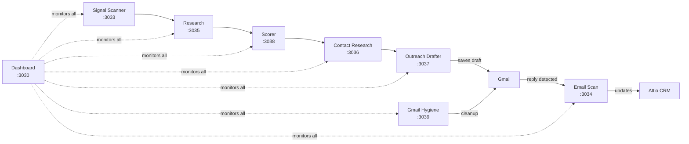

# Research Agent

A local multi-agent system for executive job search. Eight Node.js services coordinate a pipeline from signal detection through research, scoring, contact enrichment, and outreach drafting -- with Gmail integration for reply tracking and inbox hygiene. All data stays on your machine in SQLite databases.

## Agents

| Agent | Port | Directory | Purpose |
|-------|------|-----------|---------|
| Dashboard | 3030 | `dashboard/` | Health dashboard, activity log, workspace overview |
| Signal Scanner | 3033 | `signal-scanner/` | Monitors LinkedIn/news for job signals via Firecrawl |
| Email Scan | 3034 | `email-scan/` | Scans Gmail for replies, classifies intent, writes to Attio |
| Research | 3035 | `research/` | Company/firm research, interview prep, Claude-powered audit |
| Contact Research | 3036 | `contact-research/` | Contact enrichment via FullEnrich, Attio lookup |
| Outreach Drafter | 3037 | `outreach-drafter/` | Drafts personalised emails, saves to Gmail Drafts (never sends) |
| Scorer | 3038 | `scorer/` | Scores companies via configurable ELNS+H framework |
| Gmail Hygiene | 3039 | `gmail-hygiene/` | Auto-labels, unsubscribes, inbox cleanup |

## Architecture



## Requirements

- **Node.js 20+** and npm
- **Gmail account** with OAuth credentials (for email-scan, outreach-drafter, gmail-hygiene)
- **Anthropic API key** (Claude Sonnet for synthesis, Haiku for classification)
- **Attio CRM account** (optional -- for contact/deal tracking)
- **FullEnrich API key** (optional -- for contact email enrichment)
- **Firecrawl API key** (optional -- for signal-scanner web scraping)

## Quick Start

```bash
# Clone
git clone https://github.com/YOUR_USERNAME/research-agent.git
cd research-agent

# Configure your profile
cp config/user-profile.example.json config/user-profile.json
cp config/scoring-rubric.example.json config/scoring-rubric.json
cp outreach-drafter/POSITIONING.example.md outreach-drafter/POSITIONING.md
# Edit each file with your details

# Set up environment variables
cp .env.example .env
# Edit .env with your API keys
# Then copy per-agent .env.example files:
for dir in dashboard signal-scanner email-scan research contact-research outreach-drafter scorer gmail-hygiene; do
  cp "$dir/.env.example" "$dir/.env"
done
# Edit each agent's .env as needed (per-agent values override root .env)

# Install dependencies
npm install
for dir in dashboard signal-scanner email-scan research contact-research outreach-drafter scorer gmail-hygiene; do
  (cd "$dir" && npm install)
done

# Start all agents
npm run start:all

# Open dashboard
open http://localhost:3030
```

See [SETUP.md](SETUP.md) for detailed onboarding instructions.

## Configuration

### `config/user-profile.json`

Your professional profile -- name, roles, education, location, positioning statement. Used by research and outreach agents to personalise output.

### `outreach-drafter/POSITIONING.md`

Your outreach strategy document -- proof points, tone guidance, firm-specific angles, call-to-action preferences. The outreach drafter uses this to generate contextual email drafts.

### `config/attio-fields.json`

Maps Attio CRM field slugs to the fields used by the agents. Configure your status field name, protected statuses, and valid status values.

### `config/scoring-rubric.json`

The scoring dimensions, weights, and thresholds used by the Scorer agent. Default is ELNS+H (Early growth, Leadership gap, No product discipline, Scale pressure, Hiring history) for companies and TMNA (Tech specialisation, Market fit, Network signal, Activity recency) for firms.

## Scheduling

The agents are designed to run on a schedule. Examples for macOS:

### launchd (recommended)

Create a plist in `~/Library/LaunchAgents/` for each agent or use a single wrapper:

```xml
<?xml version="1.0" encoding="UTF-8"?>
<!DOCTYPE plist PUBLIC "-//Apple//DTD PLIST 1.0//EN" "http://www.apple.com/DTDs/PropertyList-1.0.dtd">
<plist version="1.0">
<dict>
    <key>Label</key>
    <string>com.research-agent.all</string>
    <key>ProgramArguments</key>
    <array>
        <string>/usr/local/bin/npm</string>
        <string>run</string>
        <string>start:all</string>
    </array>
    <key>WorkingDirectory</key>
    <string>/path/to/research-agent</string>
    <key>RunAtLoad</key>
    <true/>
    <key>KeepAlive</key>
    <true/>
    <key>StandardOutPath</key>
    <string>/tmp/jsa-all.log</string>
    <key>StandardErrorPath</key>
    <string>/tmp/jsa-all.err</string>
</dict>
</plist>
```

### cron

```cron
# Start all agents at 8am, stop at 8pm
0 8 * * 1-5  cd /path/to/research-agent && npm run start:all
0 20 * * 1-5 cd /path/to/research-agent && npm run stop:all
```

## Known Limitations

1. **No auto-send** -- the outreach drafter saves to Gmail Drafts only. You review and send manually.
2. **Perplexity is manual** -- the research agent generates prompts for you to run in the Perplexity browser; it does not call the API directly.
3. **Single user** -- designed for one person's job search. No multi-tenancy or auth.
4. **Local only** -- all agents run on localhost. No cloud deployment support.
5. **Attio field setup required** -- if using Attio CRM, you must create the expected fields manually (see SETUP.md).

## License

MIT
